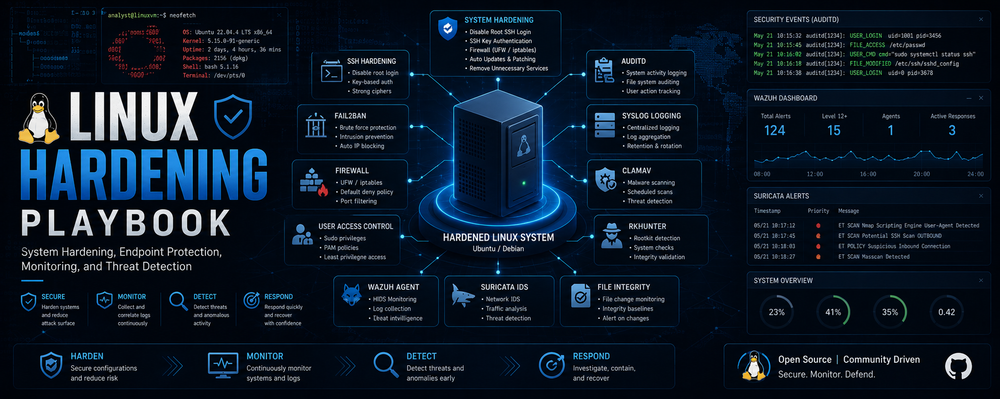

# Linux Hardening Playbook

---

## 📌 Overview

The **Linux Hardening Playbook** is a hands-on project that demonstrates how to **harden and monitor a Linux system** using **open-source tools**.  
It highlights skills in **system administration** and **SOC engineering** by focusing on endpoint protection, log analysis, and attack detection.  

---

## 🎯 Objectives

- Configure and harden a Linux VM (Ubuntu/Debian)  
- Implement **endpoint security tools** (Auditd, Fail2Ban, ClamAV, Suricata, Wazuh agent)  
- Simulate attacks (brute force, malware, unauthorized file changes)  
- Detect, log, and respond to incidents  

---

## 🔐 Security Hardening Steps

### [1. System Hardening](/system-hardening/README.md)  

- Disable root login over SSH  
- Enforce SSH key authentication + Fail2Ban  
- Configure firewall (UFW/iptables)  
- Apply automatic updates & patches  
- Remove unnecessary services and packages  

###  [2. User & Access Management](/user-access-management/README.md) 

- Create admin user with sudo privileges  
- Enforce password policies (PAM)  
- Implement least privilege access (RBAC)  

### [3. Endpoint Protection Tools](/endpoint-protection/README.md)

- **Audit & Monitoring:**  
    - Auditd (system activity logging)  
    - Syslog centralized logging  
- **Malware & Threat Detection:**  
    - ClamAV (antivirus)  
    - Rkhunter (rootkit detection)  
- **Intrusion Detection:**  
    - Wazuh agent (or OSSEC agent) installed on VM  

### [4. Network Security](/network-security/README.md)

- IDS with Suricata (local rules for endpoint traffic monitoring)  
- Port scan detection (psad)
